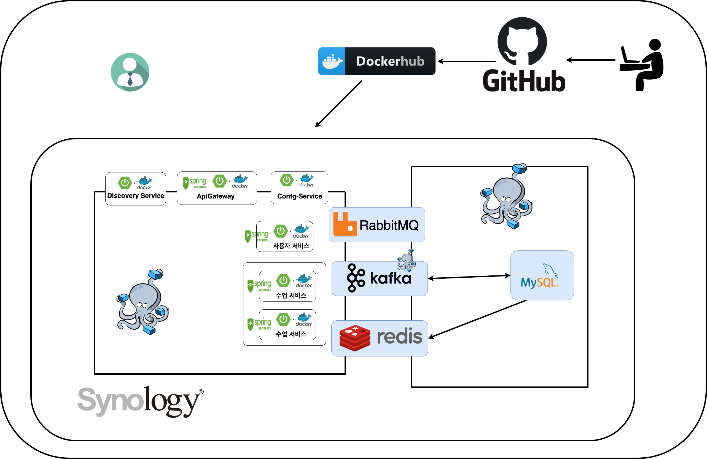

# 📅 Scheduler-MSA

**각 교사와 학생의 시간대 별 수강신청 어플리케이션**

---

## 📌 개요

교사와 학생의 시간대 정보를 기반으로 수업을 예약하고 관리할 수 있는 수강 신청 시스템입니다. 

마이크로서비스 아키텍처(MSA)를 적용하여 유연하고 확장 가능한 구조로 설계되었습니다.

---

## 🛠️ 사용 기술

### 🧱 Framework
- **Spring**: Spring Framework, Spring Data JPA, QueryDSL
- **Security**: Spring Security, JWT

### ☁️ Cloud & Messaging
- **Spring Cloud**: Config Server, Eureka
- **Messaging**: Kafka, RabbitMQ, Redis

### 🔍 Monitoring
- **Prometheus**, **Grafana**

### 🐳 Containerization & CI/CD
- **Docker**, **Docker Compose**
- **CI/CD**: GitHub Actions

### 🖥️ Infrastructure
- **Synology NAS** (개인 서버 기반 MSA 환경 구축)

---

## 📌 Git 저장소 목록
프로젝트의 각 서비스별 GitHub 저장소 링크입니다.

- **Scheduler Discovery Service** (서비스 디스커버리)  
  🔗 [GitHub Repository](https://github.com/devhong96/scheduler-discovery-service)

- **Scheduler Config Service** (환경 설정 관리)  
  🔒 *이 저장소는 비공개입니다.*

- **Scheduler Config** (환경 설정)  
  🔒 *이 저장소는 비공개입니다.*

- **Scheduler API Gateway Service** (API 게이트웨이)  
  🔗 [GitHub Repository](https://github.com/devhong96/scheduler-apigateway-service)

- **Scheduler Member Service** (회원 관리)  
  🔗 [GitHub Repository](https://github.com/devhong96/scheduler-member-service)

- **Scheduler Course Service** (코스 관리)  
  🔗 [GitHub Repository](https://github.com/devhong96/scheduler-course-service)

---

## 🚀 서비스 엔드포인트
- **Eureka 서버 (서비스 디스커버리)**  
  🔗 [Eureka Dashboard](https://seho0218.synology.me:8762/)

- **Swagger 문서 (API 문서화)**  
  🔗 [Swagger UI](https://seho0218.synology.me:8087/swagger-ui/index.html)

---
